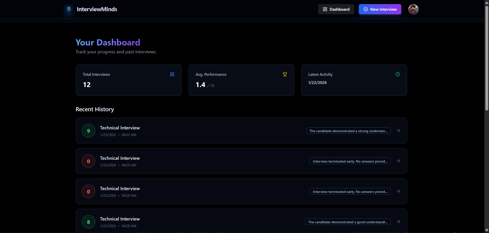
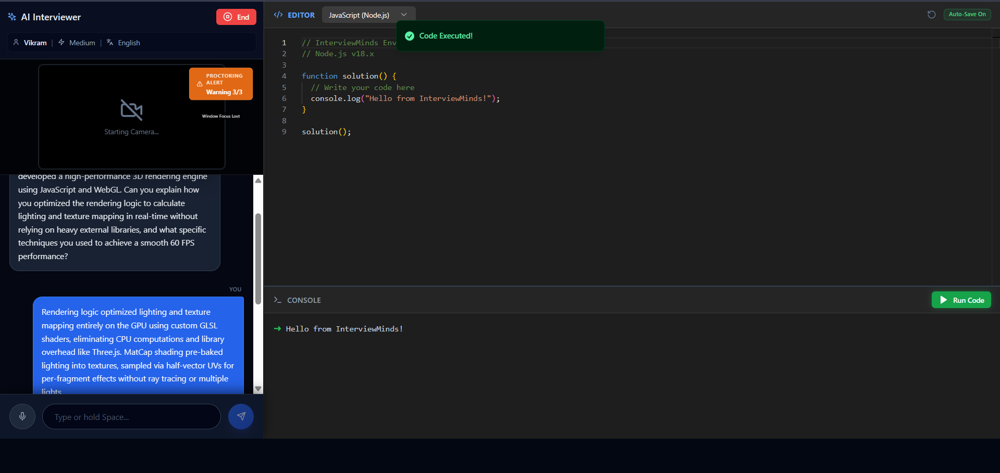
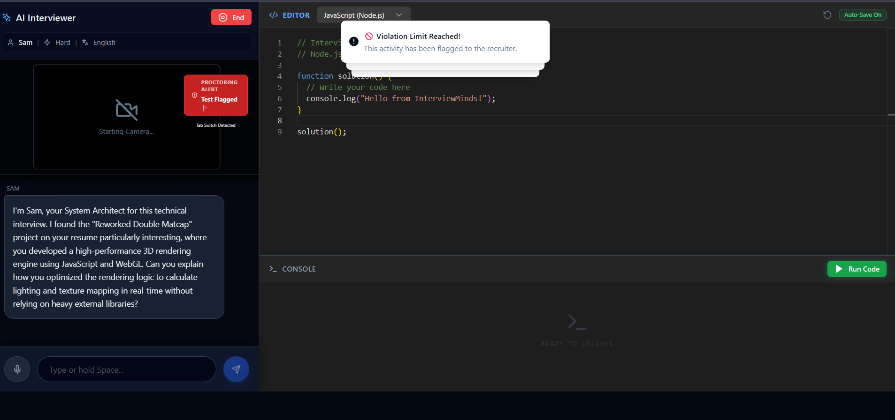
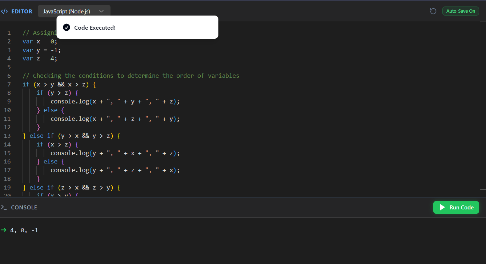

<div align="center">

[](https://interviewminds.vercel.app/)
[](https://github.com/theunstopabble/InterviewMinds/stargazers)
[](LICENSE)
[](https://www.typescriptlang.org/)
[](https://react.dev/)
[](https://nodejs.org/)
[](http://makeapullrequest.com)

# 🧠 InterviewMinds.ai
**The Flagship AI Mock Interview SaaS for 2026 Placements** 🚀

> Transform your interview preparation with a **hyper-realistic, AI-driven simulation** that analyzes your resume, proctors your session, and provides **actionable feedback**.

## 📑 Table of Contents
- [Overview](#-overview)
- [Why InterviewMinds?](#-why-interviewminds)
- [✨ Key Features](#-key-features)
- [📸 Screenshots](#-screenshots)
- [🏗️ Tech Stack](#️-tech-stack)
- [📁 Folder Structure](#-folder-structure)
- [🚀 Quick Start](#-quick-start)
- [🔐 Environment Variables](#-environment-variables)
- [🐛 Troubleshooting](#-troubleshooting)
- [📊 Roadmap](#-roadmap)
- [📡 API](#-api)
- [🤝 Contributing](#-contributing)
- [📄 License](#-license)

## 📝 Overview
InterviewMinds is a **production-grade, full-stack AI platform** designed to simulate **high-pressure technical interviews**. Unlike generic chatbots, InterviewMinds **parses your uploaded resume** to generate **context-aware questions** specific to your projects and tech stack.

Powered by **TurboRepo Monorepo** architecture, it combines **React/Vite frontend** with **Node/Express backend**. Leverages **Groq (Llama 3)** for ultra-low latency conversational AI, **TensorFlow.js** for real-time proctoring, and **live Code Sandbox** for technical assessments.

**Live Demo**: [https://interviewminds.vercel.app/](https://interviewminds.vercel.app/)

## 🎯 Why InterviewMinds?

| Feature | InterviewMinds | Generic Chatbots | Pramp/Interviewing.io |
|---------|---------------|------------------|----------------------|
| **Resume-Based Questions** | ✅ **Personalized** | ❌ Static | ❌ Human only |
| **Real-time Proctoring** | ✅ **Face + Emotion** | ❌ None | ❌ None |
| **Live Code Compiler** | ✅ **Instant** | ❌ None | ✅ Human graded |
| **AI Voice Interviewer** | ✅ **Natural** | ⚠️ Text only | ❌ Human only |
| **Free & Open Source** | ✅ **100%** | ❌ Paid | ❌ Paid |
| **Low Latency AI** | ✅ **<500ms** | ❌ Slow | N/A |

## ✨ Key Features

### 🤖 AI-Driven Intelligence
- **Deep Resume Analysis**: PDF parsing → tech stack extraction → personalized questions
- **Adaptive Personas**: Vikram (Strict Tech), Neha (HR Friendly), Sam (System Design)
- **Contextual Questioning**: Questions evolve based on your responses

### 🎥 Immersive Interview Experience
- **Voice-to-Voice**: Real-time STT + TTS for natural conversation
- **Live Coding Sandbox**: CodeEditor + compiler with instant execution
- **Ultra Low Latency**: Groq API (<500ms responses)

### 🛡️ Smart Proctoring
- **Face Detection**: Monitors presence (TensorFlow.js)
- **Anti-Cheating**: Tab-switch + full-screen enforcement
- **Emotion Analysis**: Confidence/stress level tracking

### 📊 Analytics & Feedback
- **Detailed Scorecards**: Technical + Communication scores
- **Radar Charts**: Visual strength/weakness analysis
- **Video Review**: Timestamped feedback playback

## 📸 Screenshots

### Dashboard & Setup


### Live Interview Experience


### Proctoring + Code Editor
<div align="center">
  
  
</div>

## 🏗️ Tech Stack

| Category | Technologies |
|----------|-------------|
| **Monorepo** | TurboRepo, npm workspaces |
| **Frontend** | React 18, Vite, TypeScript, Tailwind CSS, Shadcn UI |
| **Backend** | Node.js 20, Express, TypeScript |
| **Database** | MongoDB (Mongoose ODM) |
| **Auth** | Clerk (Google/GitHub/Email) |
| **AI/ML** | Groq (Llama 3), Google Gemini, TensorFlow.js |
| **Media** | Cloudinary, WebRTC |
| **Deployment** | Vercel (Frontend), Render (Backend) |

## 📁 Folder Structure

InterviewMinds
├── apps
│ ├── api # Backend Server (Node/Express)
│ │ ├── src
│ │ │ ├── config # Cloudinary/DB Config
│ │ │ ├── models # MongoDB Schemas (Interview, Resume)
│ │ │ ├── routes # API Routes (chat, compiler, interview, resume)
│ │ │ └── index.ts # Entry point
│ └── web # Frontend Client (React/Vite)
│ ├── public/models # TensorFlow.js Face Models
│ ├── src
│ │ ├── components # UI (ProctoringUI, CodeEditor)
│ │ ├── hooks # useSpeech, useProctoring
│ │ └── pages # Dashboard, Interview, Feedback
├── packages/shared # Shared Types/Utils
├── turbo.json # Monorepo Config
└── package.json


## 🚀 Quick Start

### Prerequisites
- Node.js **v20+**
- MongoDB (Atlas recommended)
- Clerk Account
- Groq & Gemini API Keys

### Installation
```bash
git clone https://github.com/theunstopabble/InterviewMinds.git
cd InterviewMinds

# Install all dependencies
npm install

# Backend deps
cd apps/api && npm install && cd ../..

# Frontend deps  
cd apps/web && npm install && cd ../..
```
Environment Setup
Copy .env.example to .env in apps/api/ and apps/web/

Run Development
```bash
npm run dev
# Backend: http://localhost:8000
# Frontend: http://localhost:5173
```
🔐 Environment Variables

Backend (apps/api/.env)

```bash
PORT=8000
MONGO_URI=mongodb+srv://...
CLERK_SECRET_KEY=sk_test_...
GEMINI_API_KEY=AIzaSy...
GROQ_API_KEY=gsk_...
CLOUDINARY_CLOUD_NAME=...
CLIENT_URL=http://localhost:5173
```

Frontend (apps/web/.env)

```bash
VITE_CLERK_PUBLISHABLE_KEY=pk_test_...
VITE_API_URL=http://localhost:8000/api
```
🐛 Troubleshooting
| Issue              | Solution                                   |
| ------------------ | ------------------------------------------ |
| Port 8000 in use   | lsof -ti:8000 \| xargs kill -9             |
| MongoDB connection | Check Atlas IP whitelist                   |
| Clerk auth fail    | Verify publishable/secret keys             |
| AI API errors      | Check rate limits in Groq/Gemini dashboard |

📊 Roadmap
 Phase 1: Core Architecture + Auth

 Phase 2: AI Brain + Resume Parsing

 Phase 3: Interview Loop + Compiler

 Phase 4: Proctoring MVP

 Phase 5: Redis Caching + Scale

 Phase 6: Payments + ATS Integration

 🤝 Contributing

 1. Fork the project
 2. Create feature branch: git checkout -b feature/YourFeature
 3. Commit: git commit -m 'Add YourFeature'
 4. Push: git push origin feature/YourFeature
 5. Open Pull Request

 📄 License
 Distributed under the MIT License. See LICENSE for more information.
```
 <div align="center"> **Built with ❤️ by [Gautam Kumar](https://github.com/theunstopabble)** [](https://linkedin.com/in/your-profile) [](https://your-portfolio.com) </div> ```