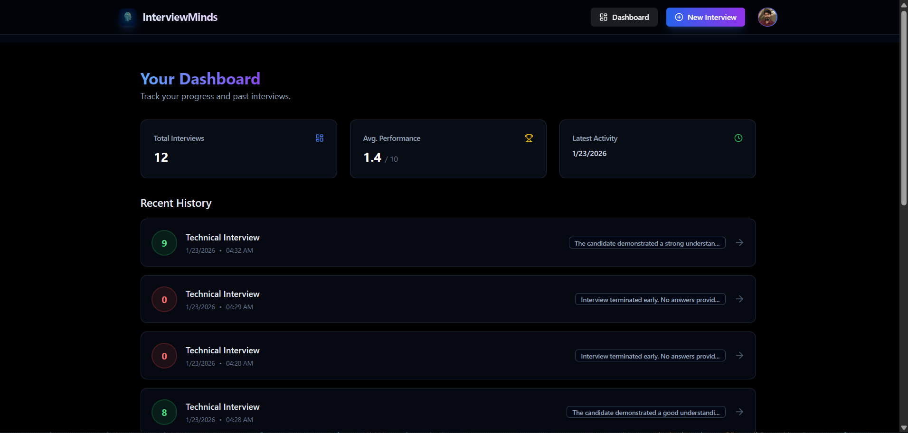
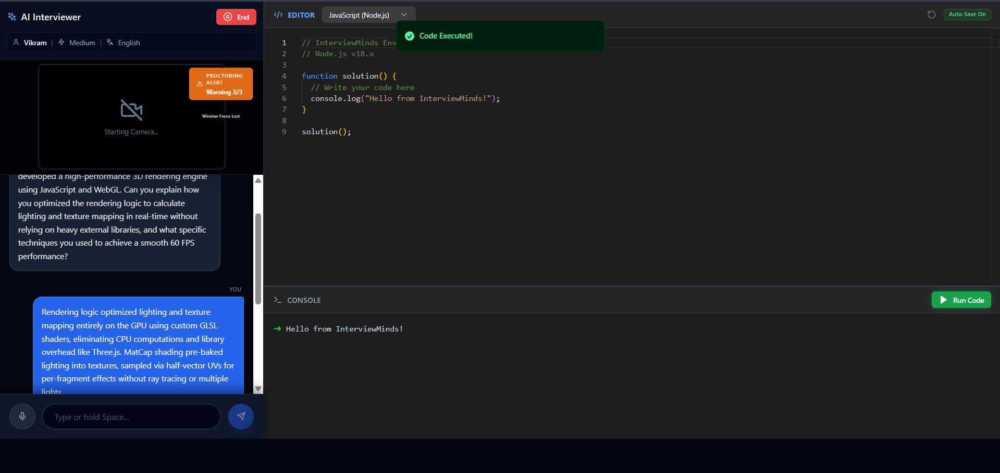
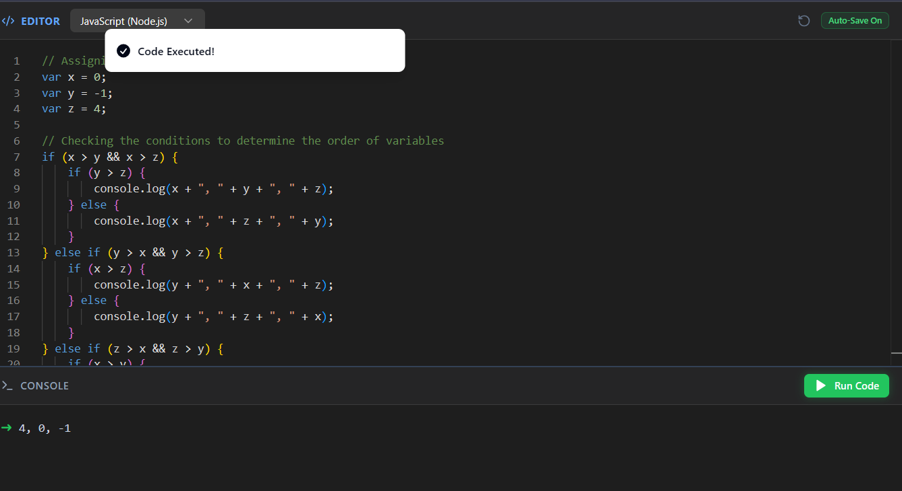
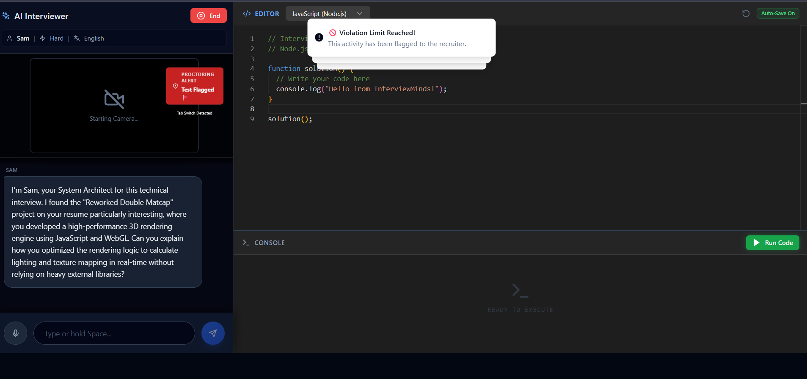

<div align="center">
  
  <h1>InterviewMinds</h1>
  <p><b>Enterprise-Grade AI Mock Interview Platform</b></p>
  <p>
    <a href="https://interviewminds.vercel.app/"></a>
    <a href="https://github.com/theunstopabble/InterviewMinds"></a>
    <a href="LICENSE"></a>
  </p>
  <p>
    
    
    
    
    
  </p>
</div>

# InterviewMinds
**Production-Grade Enterprise AI Mock Interview Platform**

> An enterprise-grade interview simulation platform featuring AI-driven assessment, real-time proctoring, truthfulness verification, and comprehensive analytics—built for organizations requiring secure, scalable, and compliance-ready candidate evaluation.

---

## Table of Contents
- [Architecture Overview](#architecture-overview)
- [Features](#features)
- [Technology Stack](#technology-stack)
- [Project Structure](#project-structure)
- [Getting Started](#getting-started)
- [Configuration](#configuration)
- [API Reference](#api-reference)
- [Documentation](#documentation)
- [Contributing](#contributing)
- [License](#license)

---

## Architecture Overview

InterviewMinds implements a **monolithic Turborepo architecture** optimized for enterprise deployment. The system comprises three primary layers:

| Layer | Technology | Purpose |
|-------|------------|---------|
| **Frontend** | React 18 + Vite | Dynamic UI with Shadcn UI components |
| **API Gateway** | Express + TypeScript | RESTful services with middleware pipeline |
| **Data Layer** | MongoDB + Redis | Persistent storage with caching |

**Infrastructure Pattern:**
- **Compute**: Node.js 20 (containerized via Docker)
- **AI Inference**: Groq API (Llama 3) for sub-500ms response latency
- **Real-time Processing**: TensorFlow.js for client-side ML inference
- **Async Jobs**: BullMQ for background task processing
- **Observability**: Sentry (tracing), Prometheus (metrics)

---

## Features

### Core Interview Engine
- **AI-Powered Assessment**: LLM-driven interviewer with conversation memory and contextual follow-ups
- **Multi-Modal Analysis**: Voice (STT/TTS), facial expressions, gesture recognition
- **Live Coding Environment**: Sandboxed code execution with security analysis

### Intelligent Proctoring
- **Behavioral Analytics**: Face detection, eye tracking, expression analysis
- **Environment Monitoring**: Tab-switch detection, full-screen enforcement
- **Audio Metrics**: Speech pace, filler word detection, voice stress analysis

### Resume Intelligence
- **Parsing & Analysis**: PDF extraction with tech stack mapping
- **Job Matching**: Skill gap analysis with weighted scoring
- **Verification Engine**: Fact-checking, timeline validation, red flag detection

### Enterprise Security
- **Data Protection**: E2E encryption (RSA + AES-256)
- **Access Control**: RBAC, biometric authentication
- **Fraud Prevention**: Browser fingerprinting, anomaly detection, geo-blocking

### Enterprise Operations
- **Scheduling**: Calendar-based booking with timezone handling
- **Pipeline Management**: Kanban-based candidate tracking
- **Reporting**: PDF/CSV/JSON exports with brand customization
- **Compliance**: Audit logging, GDPR export, consent management

---

## Screenshots

### Dashboard

*Real-time interview statistics and performance metrics*

### Live Interview

*AI-powered interview with real-time voice and video analysis*

### Code Editor

*Integrated coding environment with syntax highlighting and execution*

### Proctoring Monitor

*AI-powered proctoring with face detection and behavior analysis*

---

## Technology Stack

| Category | Implementation |
|----------|----------------|
| **Monorepo** | Turborepo, npm workspaces |
| **Frontend** | React 18, Vite, TypeScript, Tailwind CSS, Shadcn UI |
| **Backend** | Node.js 20, Express, TypeScript |
| **Database** | MongoDB (Mongoose ODM) |
| **Cache/Queue** | Redis, BullMQ |
| **Authentication** | Clerk (OAuth), Custom JWT, Biometric |
| **AI/ML** | Groq (Llama 3), Google Gemini, TensorFlow.js |
| **Security** | E2E Encryption, RBAC, CSRF Protection |
| **Observability** | Sentry, Prometheus |
| **Media** | Cloudinary, WebRTC |

---

## Project Structure

```
InterviewMinds/
├── apps/
│   ├── api/                           # Backend API Server
│   │   ├── src/
│   │   │   ├── lib/                   # Business logic services (79 modules)
│   │   │   ├── routes/                # REST API routes (32 endpoints)
│   │   │   ├── middleware/            # Auth, validation, audit
│   │   │   ├── models/                # MongoDB schemas (10 collections)
│   │   │   └── index.ts               # Entry point
│   │   └── Dockerfile
│   └── web/                          # Frontend Client
│       ├── src/
│       │   ├── components/            # Reusable UI components
│       │   ├── hooks/                 # Custom React hooks
│       │   ├── pages/                 # Route pages (13)
│       │   ├── services/              # API client services (45)
│       │   └── lib/                   # Utilities
│       ├── public/models/             # TensorFlow.js models
│       └── Dockerfile
├── packages/
│   └── shared/                       # Shared TypeScript types
├── docs/                             # System documentation
│   ├── API.md                        # REST API reference
│   ├── ARCHITECTURE.md               # System architecture
│   ├── DB_SCHEMA.md                  # Database schema
│   ├── WORKFLOW.md                   # Process flows
│   └── DEPLOYMENT.md                 # Deployment guide
└── docker-compose.yml                # Container orchestration
```

---

## Getting Started

### Prerequisites

| Requirement | Version | Notes |
|-------------|---------|-------|
| Node.js | v20+ | LTS recommended |
| MongoDB | v6.0+ | Atlas or local |
| Redis | v7.0+ | For caching/queue |
| npm | v10+ | Package management |

### Installation

```bash
# Clone repository
git clone https://github.com/theunstopabble/InterviewMinds.git
cd InterviewMinds

# Install dependencies
npm install
```

### Development Environment

```bash
# Start all services (API + Web)
npm run dev
```

| Service | Endpoint |
|---------|----------|
| Backend API | http://localhost:8000 |
| Frontend | http://localhost:5173 |

### Production (Docker)

```bash
docker-compose up -d
```

---

## Configuration

### Backend Environment

Create `apps/api/.env`:

```bash
# Server
NODE_ENV=development
PORT=8000

# Database
MONGO_URI=mongodb+srv://<user>:<pass>@cluster.mongodb.net/interviewminds
REDIS_URL=redis://localhost:6379

# Security
JWT_SECRET=<32-char-minimum-secret>
CORS_ORIGINS=http://localhost:5173,http://localhost:5174

# Authentication (Clerk)
CLERK_PUBLISHABLE_KEY=pk_test_...
CLERK_SECRET_KEY=sk_test_...

# AI Services
GROQ_API_KEY=gsk_...
GEMINI_API_KEY=...

# Azure Speech (TTS/STT)
AZURE_SPEECH_KEY=...
AZURE_SPEECH_REGION=centralindia

# Media Storage
CLOUDINARY_CLOUD_NAME=...
CLOUDINARY_API_KEY=...
CLOUDINARY_API_SECRET=...

# Monitoring
SENTRY_DSN=https://...
```

### Frontend Environment

Create `apps/web/.env`:

```bash
VITE_CLERK_PUBLISHABLE_KEY=pk_test_...
VITE_API_URL=http://localhost:8000/api
VITE_SENTRY_DSN=https://...
```

---

## API Reference

| Domain | Endpoints | Description |
|--------|-----------|-------------|
| **Authentication** | `/api/auth/*` | JWT-based auth with Clerk integration |
| **Security** | `/api/e2e-encryption/*`, `/api/biometric/*`, `/api/fraud-detection/*`, `/api/geo-fencing/*` | Enterprise security layer |
| **Interview** | `/api/interview/*`, `/api/chat/*`, `/api/compiler/*` | Core interview functionality |
| **Proctoring** | `/api/proctoring/*` | Real-time monitoring |
| **Assessment** | `/api/resume/*`, `/api/job-matching/*`, `/api/questions/*`, `/api/answer-validation/*` | Candidate evaluation |
| **Scheduling** | `/api/scheduling/*`, `/api/question-bank/*`, `/api/scorecard/*` | Interview management |
| **AI/ML** | `/api/llm-interviewer/*`, `/api/multimodal-ai/*`, `/api/smart-assessment/*`, `/api/analytics/*` | Intelligence layer |
| **Collaboration** | `/api/collaboration/*`, `/api/panel-interview/*` | Real-time features |
| **Enterprise** | `/api/sso/*`, `/api/ats/*`, `/api/tenants/*`, `/api/compliance/*` | Organizational features |
| **Reporting** | `/api/reports/*`, `/api/infrastructure/*`, `/api/developer/*` | Operations |

> Full API documentation available in `docs/API.md`

---

## Documentation

| Document | Content |
|----------|---------|
| `docs/API.md` | Complete REST API reference with request/response schemas |
| `docs/ARCHITECTURE.md` | System design, component relationships, data flow |
| `docs/DB_SCHEMA.md` | MongoDB collections, indexes, relationships |
| `docs/WORKFLOW.md` | User journeys, process diagrams, state machines |
| `docs/DEPLOYMENT.md` | Infrastructure setup, CI/CD, monitoring |

---

## Contributing

1. Fork the repository
2. Create feature branch: `git checkout -b feature/FeatureName`
3. Commit with conventional commits: `git commit -m 'feat: add feature'`
4. Push to branch: `git push origin feature/FeatureName`
5. Open Pull Request

---

## License

MIT License. See `LICENSE` for details.

---

<div align="center">
  <p>Built by <a href="https://gautam-kr.vercel.app" target="_blank">Gautam Kumar</a></p>
  <p>
    <a href="https://www.linkedin.com/in/gautamkr62" target="_blank">
      
    </a>
  </p>
</div>